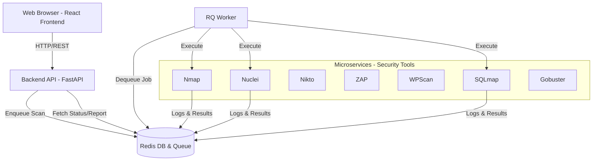

# PentaaS OneClick Scanner 🚀

**PentaaS OneClick Scanner**, siber güvenlik uzmanları ve sistem yöneticileri için geliştirilmiş, **Docker tabanlı, modüler ve otomatik** bir zafiyet tarama ve analiz platformudur. Tek bir tıklama ile hedef sistem üzerinde kapsamlı (White, Gray, Black Box) güvenlik testleri gerçekleştirir ve sonuçları detaylı raporlar halinde sunar.

Tamamen **mikroservis mimarisine** uygun olarak tasarlanan bu proje, her bir güvenlik aracını izole konteynerlerde çalıştırır ve merkezi bir Redis tabanlı kuyruk sistemi ile yönetir.

---

## 🌟 Öne Çıkan Özellikler

*   **3 Farklı Tarama Modu:**
    *   ⚪ **White Box:** Bilgi toplama ve hızlı yüzey taraması (TestSSL, Dirsearch, Nikto, WhatWeb vb.).
    *   🔘 **Gray Box:** Orta seviye analiz (ZAP Baseline, WPScan, SSLyze).
    *   ⚫ **Black Box:** Saldırgan simülasyonu ve derin zafiyet taraması (Nuclei, Full Nikto).
*   **Modern Web Arayüzü (React):**
    *   Kullanıcı dostu, "New Scan" ve "Scan History" sekmeleri.
    *   Gerçek zamanlı ilerleme durumu ve log akışı.
    *   Şık ve temiz tasarım.
*   **Gelişmiş Raporlama:**
    *   Her tarama için **HTML formatında**, tarayıcı üzerinden görüntülenebilir profesyonel raporlar.
    *   Taramaların geçmişini görüntüleme ve yönetme.
*   **Performanslı Backend (FastAPI & Redis):**
    *   Asenkron görev yönetimi (RQ Worker).
    *   Redis üzerinde merkezi loglama ve durum takibi.
    *   Docker Compose ile kolay dağıtım.

### 🆕 Son Güncellemeler (v2.0.1)
*   ✅ **White Box Profili 18 Araca Çıktı:** SQLmap, Commix, GitTools, Wapiti, NoSQLMap, Gobuster, Arachni ve httpx
*   ✅ **Gelişmiş Rapor Parsing:** XSS ve DNS bulguları artık detaylı gösteriliyor
*   ✅ **Paralel Execution:** Tüm araçlar eşzamanlı çalışarak tarama süresini azaltıyor
*   ✅ **Redis-Based Storage:** Tüm sonuçlar ve loglar Redis'te saklanıyor
*   ✅ **Timeout Yönetimi:** Yavaş araçlar için özel timeout ayarları
*   ✅ **Build Stabilite Düzeltmeleri:** Go builder image etiketi güncellendi, NoSQLMap build adımı sadeleştirildi

---

## 🛠️ Entegre Güvenlik Araçları (Services)

Aşağıdaki araçların her biri, kendi izole Docker konteynerinde (%100 Mikroservis) çalışır:

### White Box Araçları (18 Araç)
| Servis Adı | Açıklama |
| :--- | :--- |
| **Nmap** | Ağ keşfi ve port taraması. |
| **TestSSL** | SSL/TLS şifreleme ve protokol analizi. |
| **Dirsearch** | Web yolu (path) ve dosya keşfi. |
| **Nikto** | Web sunucusu güvenlik tarayıcısı. |
| **WhatWeb** | Web teknolojilerini tanımlama. |
| **Arjun** | HTTP parametre keşfi. |
| **Dalfox** | XSS (Cross-Site Scripting) zafiyet tarayıcısı. |
| **Wafw00f** | Web Application Firewall (WAF) tespiti. |
| **DNSRecon** | DNS kayıtları ve alt alan adı keşfi. |
| **Nuclei** | Şablon tabanlı gelişmiş zafiyet tarayıcısı (tech-detect mode). |
| **SQLmap** ⭐ | SQL injection tespiti ve exploitation. |
| **Commix** ⭐ | Command injection zafiyet tarayıcısı. |
| **GitTools** ⭐ | Açık .git repository tarayıcısı. |
| **Wapiti** ⭐ | Web zafiyet tarayıcısı (fuzzing). |
| **NoSQLMap** ⭐ | NoSQL injection test aracı. |
| **Gobuster** ⭐ | Directory/DNS/vhost bruteforce. |
| **Arachni** ⭐ | Scriptable web güvenlik tarayıcısı. |
| **httpx** ⭐ | HTTP/HTTPS canlı endpoint doğrulama ve teknoloji tespiti. |

### Gray Box Araçları (4 Araç)
| Servis Adı | Açıklama |
| :--- | :--- |
| **Nmap** | Servis versiyonu tespiti (-sV -sC). |
| **WPScan** | WordPress güvenlik tarayıcısı. |
| **ZAP (OWASP)** | Web uygulaması güvenlik tarayıcısı (Baseline). |
| **SSLyze** | Hızlı SSL/TLS kütüphane analizi. |

### Black Box Araçları (3 Araç)
| Servis Adı | Açıklama |
| :--- | :--- |
| **Nmap** | Agresif tarama (-A). |
| **Nikto** | Full web sunucu taraması. |
| **Nuclei** | Tüm şablonlarla zafiyet taraması. |

> ⭐ **Yeni eklenen araçlar** - awesome-pentest listesinden entegre edildi.

**Toplam:** 25 farklı güvenlik aracı

---

## 🚀 Kurulum ve Çalıştırma

### Gereksinimler
*   Docker ve Docker Compose

### Adım Adım Kurulum

1.  **Projeyi Klonlayın:**
    ```bash
    git clone https://github.com/zfrkrc/pentaas-oneclick.git
    cd pentaas-oneclick
    ```

2.  **Servisleri Başlatın:**
    Bu komut, frontend, backend, redis, worker ve tüm güvenlik araçlarını (25+ servis) derleyip başlatacaktır. İlk kurulumda imajların inmesi ve derlenmesi biraz zaman alabilir.
    ```bash
    docker compose up --build -d
    ```

3.  **Uygulamaya Erişin:**
    Tarayıcınızda `http://localhost` adresine gidin.

---

## 📖 Kullanım

### Yeni Tarama Başlatma (New Scan)
1.  **"New Scan"** sekmesine tıklayın.
2.  **Target** alanına hedef IP veya alan adını girin (Örn: `example.com` veya `192.168.1.1`).
3.  **Scan Mode** seçin (White, Gray veya Black Box).
4.  **"Start Scan"** butonuna basın.
5.  Tarama ilerlemesini canlı olarak izleyin. Araçların (Nmap, Nuclei vb.) durumu anlık olarak güncellenecektir.

### Geçmiş Taramalar (Scan History)
1.  **"Scan History"** sekmesine geçin.
2.  Geçmiş taramaların listesini, tarihlerini ve durumlarını (Completed, Running) görebilirisiniz.
3.  **"View Report"** butonuna tıklayarak, ilgili taramanın detaylı HTML raporunu yeni bir sekmede açabilirsiniz.

### 🔧 Sorun Giderme

**Docker Build Hataları:**
```bash
# Önbelleği temizle ve yeniden build et
docker compose build --no-cache
```

**Redis Bağlantı Sorunları:**
```bash
# Redis durumunu kontrol et
docker compose ps redis
docker compose logs redis
```

**Tarama Sonuçları Görünmüyor:**
```bash
# Backend loglarını kontrol et
docker compose logs backend

# Worker loglarını kontrol et
docker compose logs worker
```

**Belirli Bir Aracı Test Etme:**
```bash
# Örnek: SQLmap'i manuel test et
export TARGET_URL="http://testphp.vulnweb.com"
export HOST_DATA_DIR="$(pwd)/backend/reports/test/data"
docker compose -f backend/compose/docker-compose.string.yml run --rm sqlmap
```

---

## 🏗️ Proje Mimarisi



### Dizin Yapısı
```text
pentaas-oneclick/
├── backend/
│   ├── main.py              # API Gateway & Orchestrator
│   ├── engine.py            # Tarama Motoru Mantığı
│   ├── worker.py            # Arka Plan İşçisi (Worker)
│   └── services/            # Her aracın Dockerfile ve servis kodu
│       ├── nmap/
│       ├── nuclei/
│       ├── nikto/
│       └── ...
├── frontend/
│   ├── src/                 # React Kaynak Kodları
│   │   ├── components/      # (History, Navbar vb.)
│   │   └── App.jsx          # Ana Uygulama
│   └── Dockerfile
├── nginx/
│   └── nginx.conf           # Reverse Proxy Ayarları
├── docker-compose.yml       # Tüm servislerin tanımı
└── README.md
```

---

## 🤝 Katkıda Bulunma

1.  Bu depoyu fork edin.
2.  Yeni bir özellik dalı (feature branch) oluşturun (`git checkout -b yeni-ozellik`).
3.  Değişikliklerinizi commit edin (`git commit -m 'Yeni özellik eklendi'`).
4.  Dalınızı push edin (`git push origin yeni-ozellik`).
5.  Bir Pull Request oluşturun.

---

## 📝 Lisans

Bu proje [MIT Lisansı](LICENSE) altında lisanslanmıştır.
